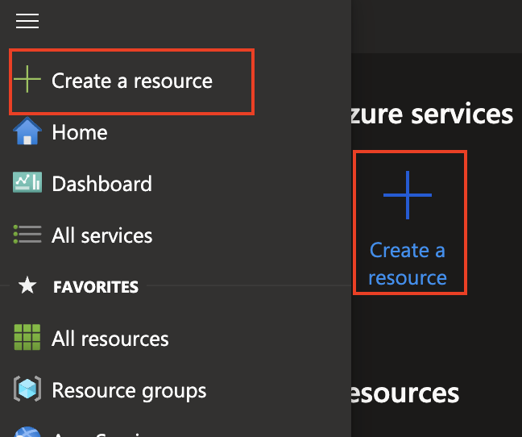
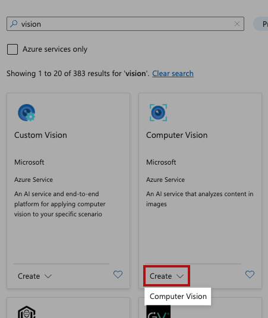
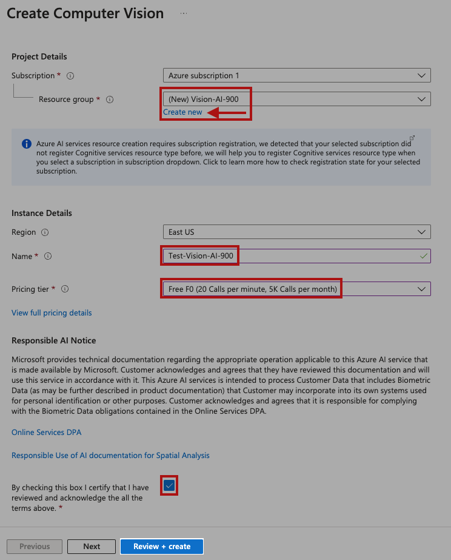
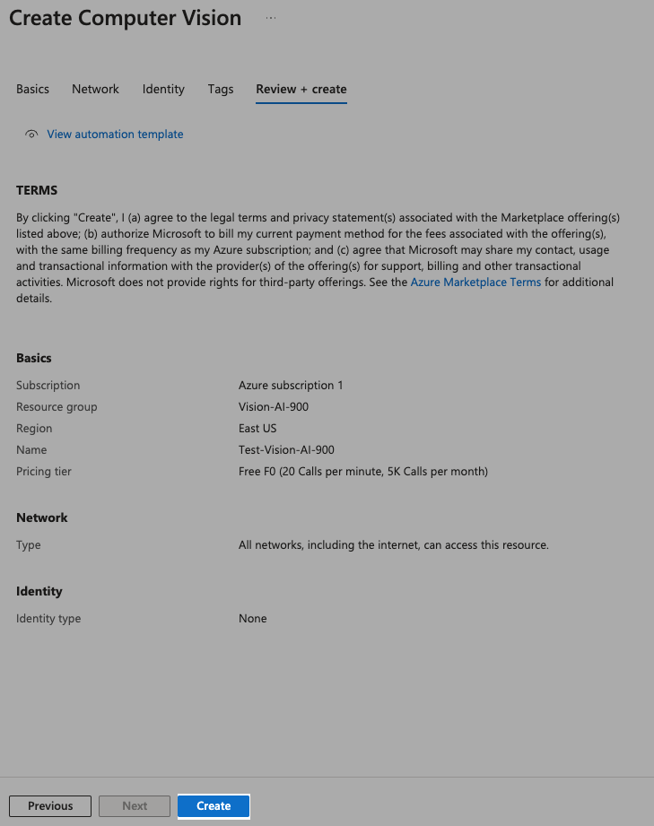
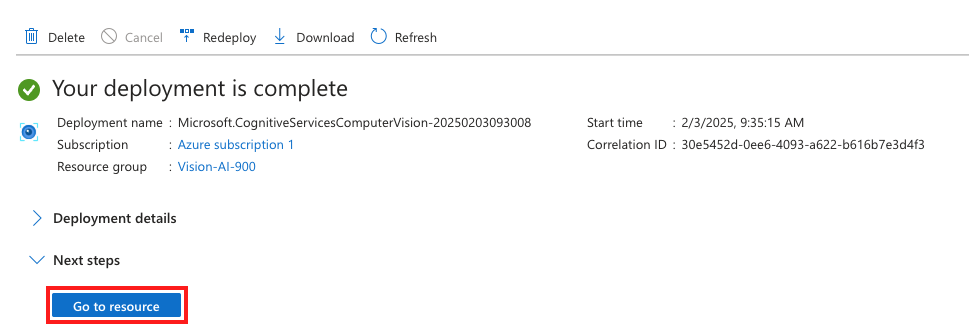
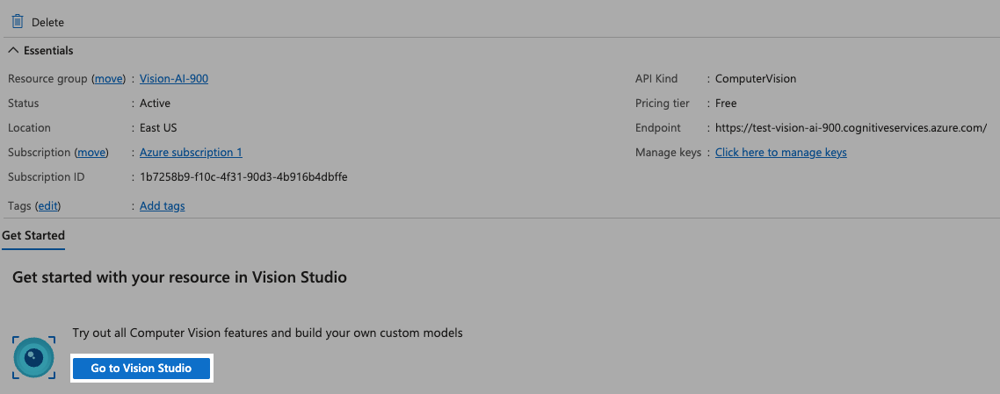
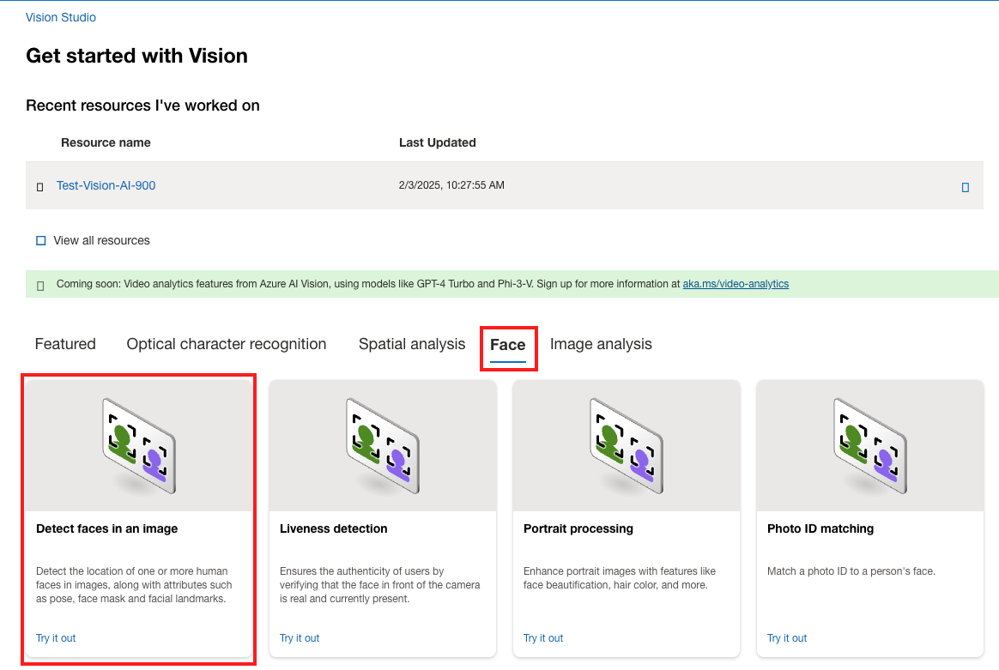
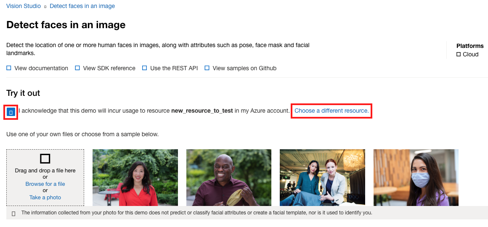
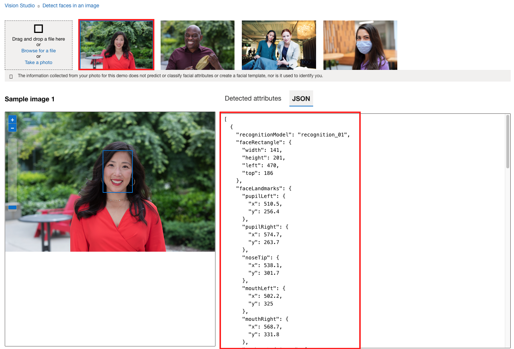
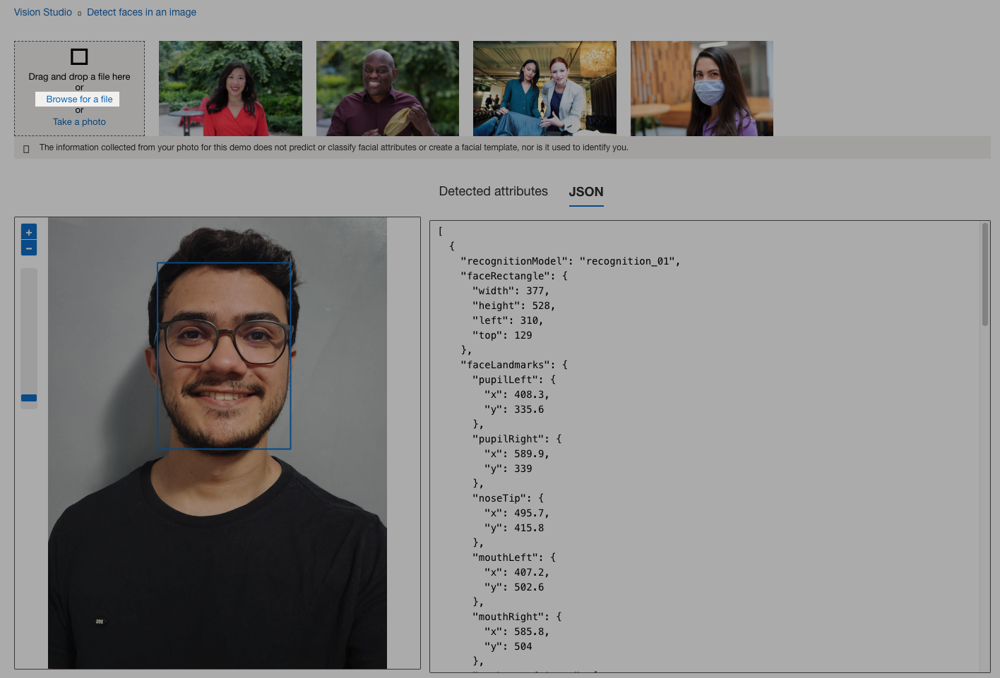

# Passo a passo para utilizar o Azure Vision

## Passo 1: Criar o recurso do Azure Vision

### 1.1 Acessar o portal do Azure
- [https://portal.azure.com/](https://portal.azure.com/)

### 1.2 Criar um novo recurso
- 

### 1.3 Pesquisar por "vision" no Marketplace
- 

### 1.4 Criar o tipo de recurso "Computer Vision"
- Na tela de criação do recurso, selecione o "Resource Group".
    - Caso não exista, selecione "Create new" e insira o nome desejado.
- Insira o nome do recurso.
- Selecione o "Pricing tier" desejado.
- Marque a opção de concordancia com os termos e condições.
- Clique em "Review + create".
- 
- Na tela seguinte, clique em "Create".
- 
- Após a criação do recurso, acesse o recurso no portal do Azure.
- 
- Acesse o Vision Studio.
- 

## Passo 2: Vision Studio
Obs: Por algum motivo os ícones nesta tela não estavam funcionando.

### 2.1 Detectar faces em uma imagem
- Na tela do Vision Studio selecione "Faces" e depois "Detect faces in an image".
- 
- Na tela seguinte marque a opção de consentimento.
    - No meu caso foi necessário criar e selecionar um novo recurso, para isso basta clicar em
    "Choose a different resource" e seguir os passos de criação. Depois de criado é necessário
    esperar alguns minutos para conseguir utilizar o novo recurso.
- 
- Teste a aplicação com a imagem de exemplo. Basta selecionar uma das imagens de exemplo e obter as informações sobre a imagem à direita.
- 
- Também é possível fazer o upload de uma imagem para teste.
- 